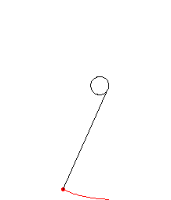

# Welcome to my page

I am trying out something new!
Github pages.

## What do I use this space for?
I haven't decided yet...

### Creating idle games? 
Maybe

### Updating PhD progress?
Sounds like double the work

### Documenting my working process?
The most boring but also the most useful

(Involute curve - the basis of 95% of my working life)

## What next?
Probably need to learn css, html, js or something else. The point is I don't know!
But I can add images!

